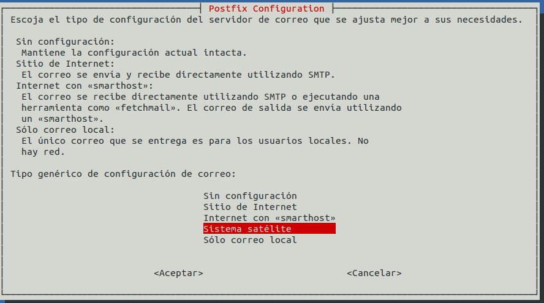
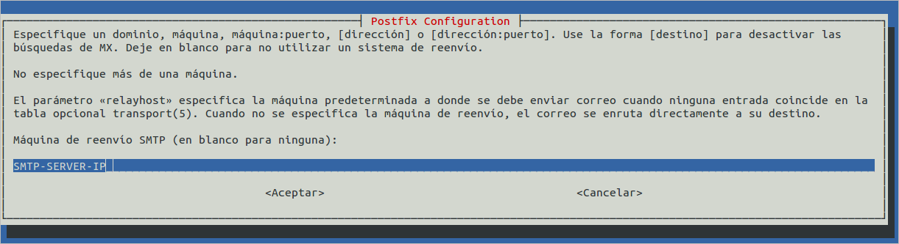

## Configuración del servidor de correo local

Si al configurar los parámetros de la aplicación decidimos que el envío de correos se tiene que realizar a través de SMTP, tenemos que tener configurado el servidor de correo local para que pueda enviar los mensajes a través del host que hemos configurado a través del interfaz web.

Una forma sencilla de hacerlo es la de instalar y configurar postfix en modo satélite1 en el propio servidor ElkarBackup. Al hacerlo eliminará exim4, el servidor SMTP por defecto (esto se podría hacer también utilizando exim4, cuestión de gustos).

```bash
root@ElkarBackup:~# apt-get install mailutils postfix
```


Elegimos ***Sistema satélite*** (todo correo saliente se envia a otra maquina, llamada host, el correo de root y postmaster se envia de acuerdo a `/etc/aliases`,  solamente se recibe correo localmente)



Y finalmente indicamos a través de qué servidor SMTP enviará los mensajes



