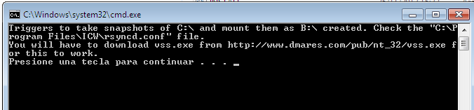

En la carpeta `/usr/share/elkarbackup/extra/windows` del servidor ElkarBackup tenemos los ficheros que tenemos que copiar en el path `c:\ElkarBackup` de la máquina cliente en la que vamos a generar los snapshots. Es importante que el nombre ElkarBackup esté escrito correctamente, con la E y la B en mayúscula y el resto de letras en minúsculas, ya que es scritp es sensible a mayúsculas y minúsculas, y si no está bien escrito nos dará errores. Tambien es necesario crear la carpeta `c:\ElkarBackup\token`, que será utilizada por los scripts.

Esta máquina, debe tener instado el software cwRsyncServer, tal y como se describe en el apartado “***4.3 Añadiendo Clientes Windows***“.

En el cliente Windows ejecutamos el programa `C:\ElkarBackup\INSTALL.bat` el cual modificará el fichero de configuración de cwRsyncServer (`c:\Archivos de Programa\ICW\rsyncd.conf`) , incorporando las líneas que mostramos a continuación.

```ini
# Phony modules to trigger snapshot creation and mounting
[MakeSnapshotCMountB]
path = /cygdrive/c/ElkarBackup/token
read only = true
transfer logging = yes
pre-xfer exec = /cygdrive/c/ElkarBackup/MakeSnapshotCMountB.cmd

[DeleteSnapshotCUmountB]
path = /cygdrive/c/ElkarBackup/token
read only = true
transfer logging = yes
pre-xfer exec = /cygdrive/c/ElkarBackup/DeleteSnapshotCUmountB.cmd

### WARNING: the following module WILL NOT WORK as expected
### the reason is that rsync tries to chdir to SomeDirectory before running the pre-xfer script. Since the B: unit does not exit it fails
### [ShadowWithSnapshot]
### path = /cygdrive/b/SomeDirectory
### read only = true
### transfer logging = yes
### pre-xfer  exec = /cygdrive/c/ElkarBackup/MakeSnapshotCMountB.cmd
### post-xfer exec = /cygdrive/c/ElkarBackup/DeleteSnapshotCUmountB.cmd
```


Tal y como se nos indica tras la ejecución del script, es necesario descargar el programa ***vss.exe*** desde http://www.dmares.com/pub/nt_32/vss.exe .



Una vez descargado, lo dejaremos en la carpeta ***c:\ElkarBackup*** junto al resto de ficheros.

