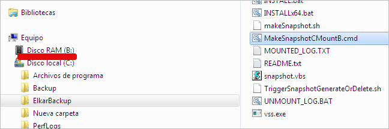

Tal y como hemos comentado anteriormente, la unidad B es visible solamente para el demonio rsync, por lo que tenemos que “creer” que lo genera, lo utiliza y finalmente lo destruye. Si somos personas de poca fé, podemos jugar a generar el snapshot con el usuario local de windows desde el propio escritorio utilizando los scripts que utiliza el demonio rsync.

Si ejecutamos el script ***C:\ElkarBackup\MakeSnapshotCMountB.cmd*** podremos observar que aparece una nueva unidad de disco RAM en la unidad B. Ahora la vemos porque la hemos generado con nuestro usuario

Y si expandimos la unidad, podremos ver que tenemos la misma información que en la unidad C. Para asegurarnos de que funciona como un snapshot, y que realmente contiene el estado del disco cuando se realizó el snapshot, podemos modificar algún fichero de la unidad C, y comprobar que el mismo fichero en la unidad B no ha sido modificado.

Como es lógico, el disco B es de solo lectura, por lo que no podremos realizar cambios ni crear nuevos ficheros.

Solo nos falta simular la liberación del snapshot. Para ello es suficiente ejecutar el script ***C:\ElkarBackup\DeleteSnapshotCUmountB.cmd***

Si tenemos interés en ver qué tipo de ***magia*** hay tras esta operación, podemos estudiar el script ***C:\ElkarBackup\snapshot.vbs*** , que es el que contiene la programación encargada de esta tarea.
