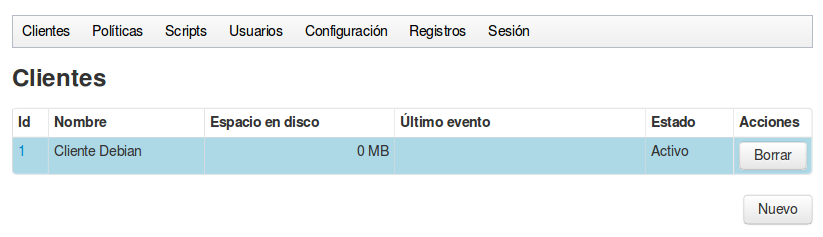
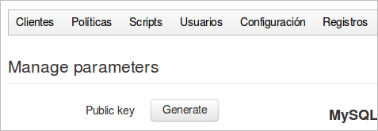
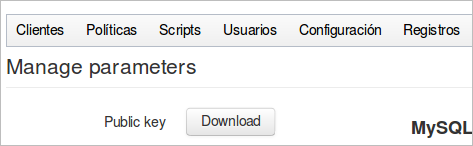
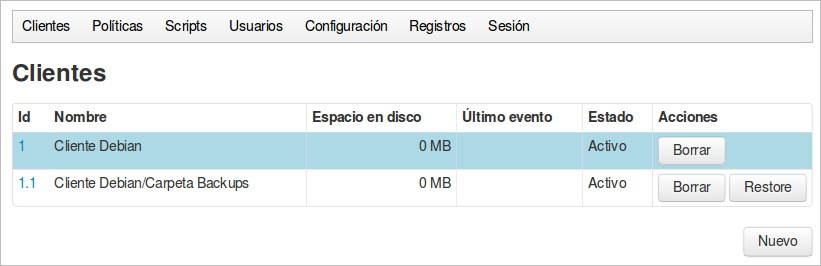
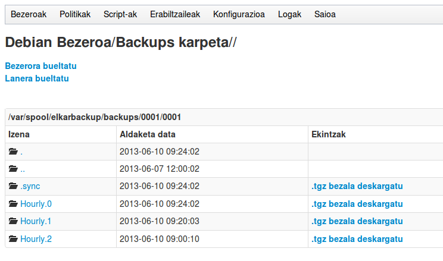
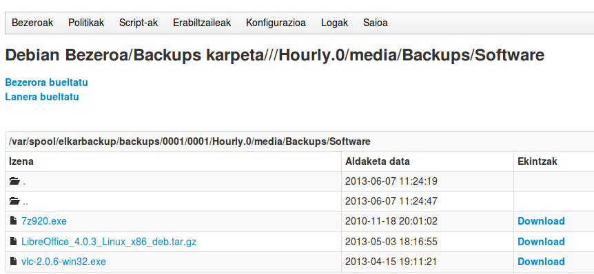
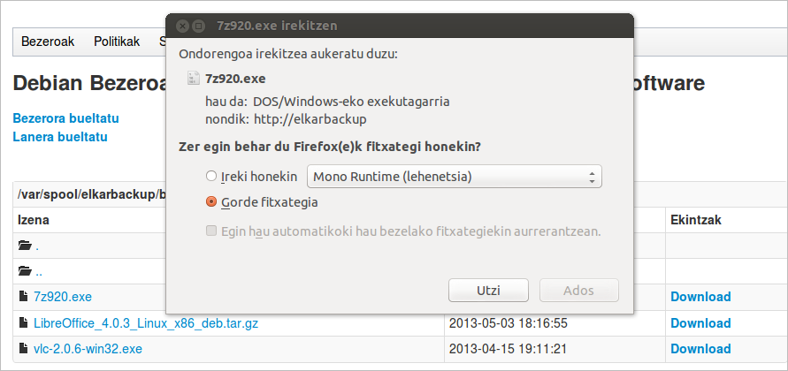

## Añadiendo clientes GNU/Linux

Para añadir un cliente hay que hacer clic sobre el botón Nuevo y se nos mostrará un nuevo formulario para introducir los datos. Hemos intentado que la aplicación sea auto-documentada, por lo que las explicaciones necesarias se encuentran en el propio formulario, y no vamos a repetirlas aquí.

Estos son los datos que utilizamos en nuestro ejemplo para el cliente GNU/Linux:

- Nombre: Cliente Debian
- URL: root@10.15.181.155
- CUOTA: -1 (Por ahora no la utilizaremos)
- Descripción: Un servidor Linux de nuestra red
- Pre/Post script: No seleccionamos nada

Si escogemos la opción del menú **Clientes → Mostrar** podremos observar que el nuevo cliente aparece en la lista, a pesar de que todavía no tiene tareas asignadas.



Pero teniendo en cuenta que en el proceso de backup la comunicación debe estar automatizada, ***¿ cómo se conectara el servidor ElkarBackup con el nuevo cliente si en ningún sitio hemos puesto su contraseña?***

Como vamos a utilizar el protocolo ssh, lo haremos mediante claves públicas/privadas.

Tendremos que hacer clic una vez en el botón ***Generar*** que encontramos en el menú principal: ***Configuración → Gestionar Parámetros*** para que el servidor genere su par de claves.



Una vez generados el botón cambia  y nos da la opción de descargar la clave pública.
En el menú principal: ***Configuración → Gestionar Parámetros → Clave Pública: Descargar***



Si hacemos clic en el botón ***Descargar*** obtendremos en el fichero ***Publickey.pub*** la clave pública del servidor Elkarbackup. Deberemos instalar esta clave pública en nuestros clientes GNU/Linux para que el servidor ElkarBackup pueda lanzar las conexiones de forma automática cuando llegue la hora de realizar las copias.

En las conexiones SSH que se crean para copiar los datos, los roles se reparten de la siguiente forma:
- Servidor ElkarBackup: Será el Cliente que abre la conexión.
- Cliente GNU/Linux: Será el servidor de la conexión ssh, por lo tanto tendrá que  tener instalado el paquete openssh-server (en la mayor parte de los casos lo tendrá instalado).

Ahora veremos como instalar la clave ***Publickey.pub*** en el Cliente. En mi equipo personal lo descargo a través del navegador, y utilizando el comando ***ssh-copy-id*** lo instalo en el usuario ***root*** del cliente. No hay ni que decir que para poder hacer esto necesitamos conocer la contraseña del usuario root del cliente.

```bash
pedro@portatil59:~/Deskargak$ ssh-copy-id -i Publickey.pub root@10.15.181.155
root@10.15.181.155's password:
Now try logging into the machine, with "ssh 'root@10.15.181.155'", and check in:
  ~/.ssh/authorized_keys

to make sure we haven't added extra keys that you weren't expecting.
```


En el caso de que no tengamos a mano un equipo con GNU/Linux desde el cual lanzar el comando, podemos lanzarlo también desde el propio servidor Elkarbackup. En este caso no haría falta descargar el fichero Publickey.pub, lo cogeríamos de su ubicación original en el servidor:

```bash
root@elkarbackup:~# ssh-copy-id -i /var/lib/elkarbackup/.ssh/id_rsa.pub root@10.15.181.155
```


Con lo que hemos hecho hemos introducido en la configuración ssh del usuario root del cliente la clave pública generada en el servidor ElkarBackup, lo cual nos habilitará para lanzar conexiones automatizadas entre ambos en adelante.

```bash
root@DebianCliente:~# ls -la /root/.ssh/authorized_keys
-rw------- 1 root root 428 jun  7 11:11 /root/.ssh/authorized_keys
root@DebianCliente:~# cat /root/.ssh/authorized_keys
ssh-rsa AAAAB3NzaC1yc2EAAAADAQABAAABAQC3HO3zn8XhBW1JqxA5qKEQZe+/fPcC47pu5l9c+s1Q+ppUD5CLaDQjUsF+0VBHtPP2Wx1HaDidFURwge5GcnRnoXV32B+Vj9rfW9wPdk6siuZ2McoS0xyqbToS2CTdbsxyjibn2CdM3RZjJa81haOllciu38V9F1t4mylJVMxBgQmNwkTBwYGt66+wpT/nQVxiDeyVK98SHb8oGKJZljpczlqgYwckRAEPSARvxFm9yyWOad3Qm7QYYGslBij4LXG1aUAARivoJdYtB4kbOnEdOO3n5BU/0Q8eIqxDw7eFdnx4UDINX+mtSuHfpRkoORoU9IZZWGz9vrLnaxqh91G3 Automatically generated key for tknikabackups.
```


En el cliente Debian se requiere el paquete ***rsync***. Si no estuviera instalado, lo podemos instalar con el siguiente comando

```bash
root@DebianCliente:~# apt-get install rsync
```


Ahora vamos a crear una nueva tarea para copiar la carpeta /media/Backups del Cliente Debian, para lo cual editaremos la configuración del cliente y haremos clic en el botón Agregar tarea que se encuentra en la parte inferior


El formulario que se nos muestra también está auto-documentado y se explica la información que hay que introducir. Para el ejemplo introduciremos los siguientes datos, dejando el resto tal y como está:

- Nombre: Carpeta Backups
- Path: /media/Backups/
- Descripción: Datos que tenemos en la carpeta Backups
- Política: Default policy

Y haremos clic en botón Guardar para que se guarden los cambios. Si ahora volvemos a la vista general de los clientes veremos que la tarea ya se muestra.



Dado que nunca se ha ejecutado, la columna ***Último evento*** todavía no muestra nada.  En adelante veremos que en esta columna se mostrará el resultado y la hora de la última ejecución.

¿ Y cuándo tendremos los datos ? Pues esto dependerá de lo planificado en la ***Política***. Nosotros le hemos asignado la política ***Default policy***, y si miramos como está definida, podremos observar cual es su programación y su política de retención.

Para entender mejor el concepto de las políticas es conveniente tener claros los conceptos que se explican el el apartado “***Un repaso de conceptos: Rsnapshot***“, ya que es la lógica que se utiliza en nuestra aplicación. Al final profundizaremos más en esta parte.

Si dejamos que pase el tiempo para que se hagan las primeras copias y posteriormente hacemos clic sobre el botón ***Restore*** podremos observar el resultado



Podemos observar que la carpeta Hourly.0 contiene los datos de la última copia, y en las siguientes ejecuciones se irán acumulando más carpetas. Si nos vamos adentrando en cualquiera de ellas podremos llegar hasta el fichero concreto que nos interesa recuperar.



Si queremos obtener el fichero, podemos descargarlo haciendo clic en el enlace


