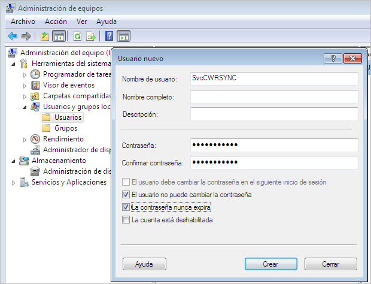
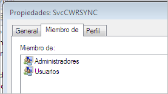
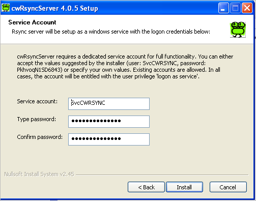
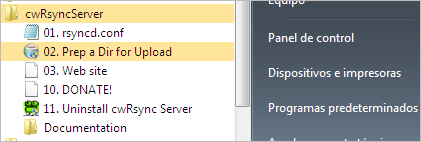
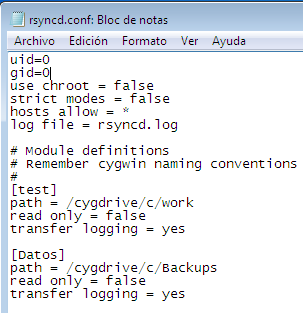
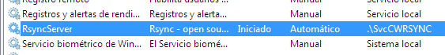
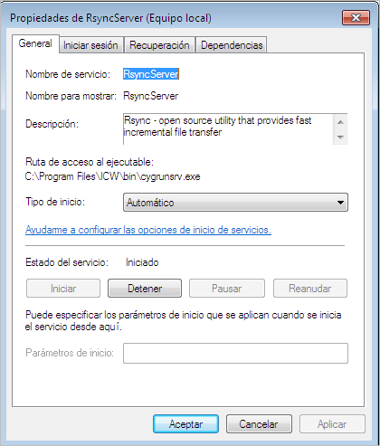
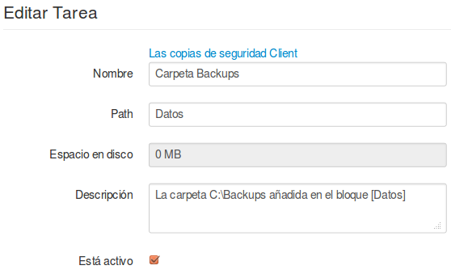
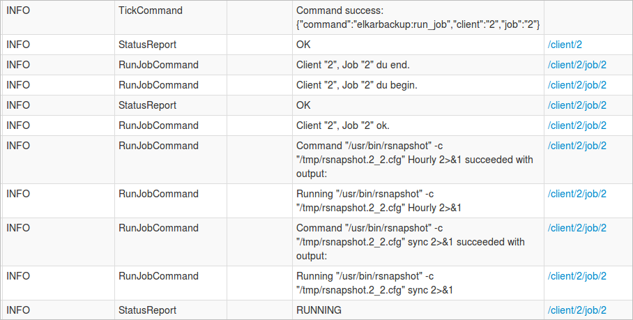

La diferencia entre los clientes Windows y Linux está en el parámetro ***URL***, el resto sería igual.

Con los servidores Windows utilizaremos el protocolo ***rsync*** en lugar de ***ssh***. Para poder hacerlo, la máquina Windows tiene que aceptar conexiones rsync, es decir, necesita un servidor rsync activo.

- Nombre: Cliente Windows
- URL: 10.15.181.156:
- CUOTA: -1
- Descripción: Un servidor Windows de nuestra red
- Pre/Post script: Lo dejamos sin seleccionar.

En el parámetro URL tras poner la IP tenemos que poner “:”, de esta forma le decimos que utilice el protocolo rsync.

Podemos encontrar distintos servidores Rsnyc para plataformas Windows. Nosotros utilizaremos la versión gratuita de [cwRsync](https://www.itefix.no/i2/content/cwrsync-free-edition), para lo cual descargaremos el programa ***cwRsyncServer 4.0.5 Installer***.

Antes de realizar la instalación añadiremos un usuario local en el servidor. En la máquina virtual con Windows7 que utilizamos en el ejemplo hemos llamado al usuario ***SvcCWRSYNC*** y le hemos puesto como contraseña ***elkarbackup***.


Dado que el servicio se va a ejecutar con este usuario, es conveniente que tenga los permisos necesarios, razón por la cual lo he añadido al grupo de administradores (probablemente con menos permisos también sería suficiente)



Ahora procedemos a la instalación del programa ***cwRsyncServer***. En la instalación nos pedirá el usuario y contraseña para este servicio, e introduciremos los que le acabamos de asignar:



Una vez finalizada la instalación nos aparecerá entre los programas disponibles, y editaremos el fichero ***rsyncd.conf*** para especificar cuales son las carpetas que queremos sincronizar. En W7 es necesario abrirlo como administrador,  en caso contrario no permite guardar los cambios. Lo haremos haciendo clic con el botón de la derecha y “ejecutándolo” como administrador.



Esta sería la configuración para configurar la carpeta  C:\Backups

Al principio ponemos estas dos líneas:
```
uid=0
gid=0
```


A continuación añadimos un bloque para cada carpeta que queremos sincronizar. En el ejemplo hemos nombrado la carpeta como ***[Datos]*** :

```
[Datos]
path = /cygdrive/c/Backups
read only = false
transfer logging = yes
```


Si la carpeta que queremos copiar en vez de estar en **c:\**Backups estuviera en **d:\**Backups , la línea path sería esta:

```
path = /cygdrive/d/Backups
```




Ahora comprobamos que el servicio está en marcha, y si no lo estuviera lo arrancaríamos especificando que el arranque tiene que ser automático






Ahora volvemos al interfaz de ElkarBackup y añadimos una tarea a nuestro cliente Windows para que haga una copia de su carpeta Backups.

Tenemos que tener en cuenta que esa carpeta en el fichero de configuración de la máquina Windows la hemos configurado en el bloque ***[Datos]***, y ese será el nombre que utilizaremos en el campo ***Path***. Además le aplicaremos la política ***Default policy***.



La guardaremos y haremos clic en el botón ***Ejecutar ahora*** para comprobar que la copia se hace bien. Esta opción nos permite lanzar la tarea sin esperar a que llegue ejecución programada.
La pantalla que nos da la visión general nos dará información también del estado de cada tarea, mostrando aquellas que están en espera ***(QUEUED)*** o en ejecución ***(RUNNING)***

Si esperamos un minuto veremos que la copia se ha realizado. En el Log también podemos ver información del resultado del proceso.



