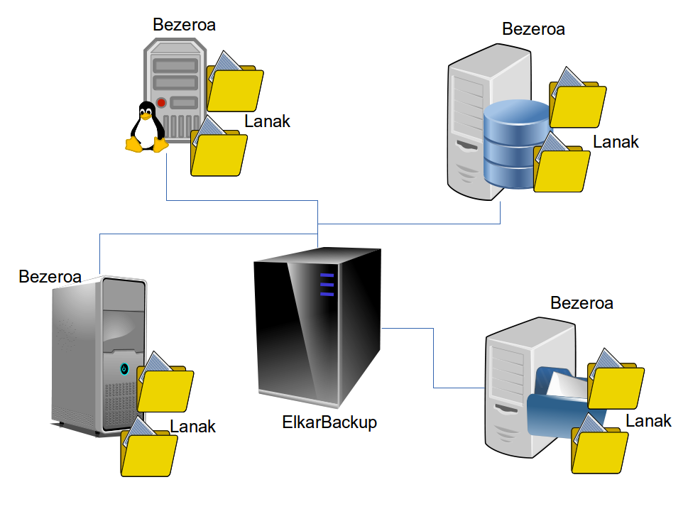

## Pero, ¿Qué son los clientes y tareas?

En esta arquitectura hablaremos de *clientes* y *tareas* :

- **Cliente**: Una máquina GNU/Linux o Windows. Queremos copiar distintas carpetas que tenemos en esta máquina (que generalmente será un servidor).

- **Tarea**: Cada carpeta (raíz) que queremos copiar de cada cliente. A cada tarea se le podrá asignar una política distinta aunque sean del mismo cliente, cada una con su frecuencia y política de retención concreta.

Por ejemplo, imaginémonos que de un servidor queremos copiar por un lado los datos de los usuarios, y por otro algunos ficheros de log que genera un servicio concreto. Querremos copiar todos estos datos, pero con una programación y una política de retención distinta en cada caso.

Nuestro servidor podrá recoger y copiar información de múltiples clientes. La única condición que tiene que cumplir es la de soportar los protocolos  **rsnyc** o **ssh**. En los servidores GNU/Linux no vamos a tener problemas, y para los servidores Windows instalaremos el software [Cwrsync](https://www.itefix.no/i2/content/cwrsync-free-edition) que nos habilitará el servicio rsync (más adelante mostramos como se configura).

El uso de rsync en la comunicación tiene una ventaja importante: Antes de comenzar con la transferencia de ficheros ambos servidores deciden si hay necesidad de copiar el fichero, y solo se envían los ficheros modificados. Tendrá más carga de CPU el servidor que envía los ficheros y más E/S el que los recibe.
