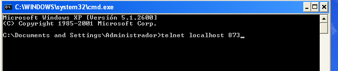

Para la transferencia de los ficheros nos estamos basando en las comunicaciones entre servidores, y estas a veces suelen ser problemáticas. El apartado de ***Logs*** puede ser muy útil al detectar la causa de estos problemas.

Al escribir este documento he tenido un problema de comunicación con el cliente Windows, y esto es lo que veía en el apartado de ***Logs***:

```
Command "/usr/bin/rsnapshot" -c "/tmp/rsnapshot.2_2.cfg" sync 2>&1 failed. Diagnostic information follows: rsync: failed to connect to 10.15.181.156: Connection timed out (110) rsync error: error in socket IO (code 10) at clientserver.c(122) [Receiver=3.0.7] 
```


El sistema me dice que tiene problemas de comunicación con el cliente a través del protocolo rsync. Puede haber al menos dos causas:
- El servicio rsync del cliente Windows va mal.
- Tenemos problemas de comunicación con el cliente y el protocolo Rsync

Para ver si es la primera opción hacemos un telnet al puerto rsync (TCP 873) desde el mismo cliente Windows (en Windows7 telnet no viene preinstalado)



Y si vemos que responde eso significa que el servicio está bien


Intentamos la misma conexión pero esta vez desde el servidor ElkarBackup hasta el cliente Windows:

```
root@ElkarBackup:~# telnet 192.168.3.109 873
Trying 192.168.3.109...
telnet: Unable to connect to remote host: Connection timed out 
```


vemos que la conexión no se establece, por lo que todo apunta a algún cortafuegos, seguramente en el cliente Windows.

En nuestro ejemplo, Windows7 tiene activado el firewall también en la red local de trabajo, y está cortando el tráfico rsync. Habría que añadir las reglas para permitir ***rsync***  (TCP 873) entre el servidor ElkarBackup y el cliente Windows. En nuestro ejemplo por ir más rápido, vamos a optar por parar el firewall.


