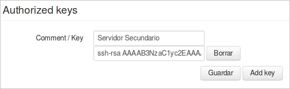

### Automatización

Si queremos automatizar esta tarea, es decir, que el servidor ***Secundario*** sincronice de forma automática el repositorio del servidor ***ElkarBackup***, es necesario volver a utilizar la estrategia de claves públicas/privadas.

En esta ocasión importaremos la clave pública del servidor ***Secundario*** en el servidor ***ElkarBackup***, o dicho de otra forma, añadiremos la clave en el fichero ***Authorized_keys***. Para ello haremos clic en el botón ***Añadir clave***.

Los campos a rellenar son dos:

- Comentario: Descripción que nos ayude a identificar la clave
- Clave: ***Clave pública*** del servidor Secundario

Para facilitar el proceso, crearemos en el servidor ***Secundario*** un usuario con el nombre elkarbackup

```bash
root@Secundario:~$ adduser elkarbackup
'elkarbackup' erabiltzailea gehitzen...
'elkarbackup' (1001) talde berria gehitzen...
'elkarbackup' (1001) erabiltzaile berria 'elkarbackup' taldearekin gehitzen...
'/home/elkarbackup' karpeta nagusia sortzen...
'/etc/skel'(e)tik fitxategiak kopiatzen...
UNIX-pasahitz berria sartu:
UNIX-pasahitz berria sartu berriro:
passwd: pasahitza ongi eguneratu da
elkarbackup(r)en erabiltzaile informazioa aldatzen
Idatzi balio berria, edo sakatu 'Sartu' tekla lehenetsirako
	Izen osoa []:
	Gela zenbakia []:
	Laneko telefonoa []:
	Etxeko telefonoa []:
	Bestelakoa []:
Informazioa zuzena da? [B/e] B
```


A continuación abrimos una sesión con ese usuario

```bash
root@Secundario:~$ su - elkarbackup
```


y creamos su clave RSA

```bash
elkarbackup@Secundario:~$ ssh-keygen -t rsa
Generating public/private rsa key pair.
Enter file in which to save the key (/home/elkarbackup/.ssh/id_rsa):
Created directory '/home/elkarbackup/.ssh'.
Enter passphrase (empty for no passphrase):
Enter same passphrase again:
Your identification has been saved in /home/elkarbackup/.ssh/id_rsa.
Your public key has been saved in /home/elkarbackup/.ssh/id_rsa.pub.
The key fingerprint is:
1a:65:fd:52:08:05:89:8a:3a:89:68:23:72:c3:37:0e elkarbackup@portatil59
The key's randomart image is:
+--[ RSA 2048]----+
|       .o+.      |
|      . .o .     |
|   . .  o o .    |
|  . .  o   o     |
|o+    . S . .    |
|OoE o  o   .     |
|+o.= ..          |
|    .            |
|                 |
+-----------------+
```


Ahora podemos ver y copiar su clave pública

```bash
elkarbackup@Secundario:~$ cat .ssh/id_rsa.pub
ssh-rsa AAAAB3NzaC1yc2EAAAADAQABAAABAQCuklE6TI16fU5pmTeU4APrSgG24eblwQdnHNtntUIIRSyAkAemPil2GDpufXgPKqT+FQV02z4JiaoTMMhQpsGqS/Shz/KE/MA7pm8k9v6qnFKVpY6HXZZyvgYhH+Yy6FxxDk+QGQqQMnabzmanyxcBBdQ3ZdluYbwT5kdlgAJR8eTlN/M08hrKKeQGbEVXP3GCPWYsiDV2p6VgRgkPzCSWUgMP63668ZAoNq8mlhW8RF+BEYDF9TPh7PJaEhc+Ea5LiiggD/E2lqQmFGYTqbjELKT4b97y6nDj+2UIG0pvqZ/dN0ZMdsCMX577e8ppkafMqgwGT3D7Af4gD9KninL3 ElkarBackup@Secundario
```


y aprovechando la opción que tenemos en el interfaz web del servidor ElkarBackup, añadimos la clave en fichero ***authorized_keys*** del servidor.



Pulsamos en el botón Guardar y clave importada.

Ahora, creamos una carpeta en el servidor Secundario para guardar los datos de la réplica, y copiamos dentro el script que hemos descargado desde el interfaz web

```bash
ElkarBackup@Secundario:~$ ls -la copiarepositorio/
guztira 12
drwxrwxr-x 2 elkarbackup elkarbackup 4096 eka 10 17:02 .
drwxr-xr-x 4 elkarbackup elkarbackup 4096 eka 10 16:53 ..
-rwxrwxr-x 1 elkarbackup elkarbackup  695 eka 10 15:24 copyrepository.sh
```


y comprobamos su ejecución

```bash
elkarbackup@portatil59:~$ cd copiarepositorio/
elkarbackup@portatil59:~/copiarepositorio$ ./copyrepository.sh
Backing up job 0002/0002
Backing up job 0001/0001
Backing up mysql DB
Backing up uploads
```


Como podemos observar hacemos la replicación sin tener que introducir ni usuario ni contraseña

```bash
elkarbackup@portatil59:~/copiarepositorio$ ls -la
guztira 128
drwxrwxr-x 5 elkarbackup elkarbackup   4096 eka 10 17:04 .
drwxr-xr-x 4 elkarbackup elkarbackup   4096 eka 10 16:53 ..
drwxrwxr-x 3 elkarbackup elkarbackup   4096 eka 10 17:04 0001
drwxrwxr-x 3 elkarbackup elkarbackup   4096 eka 10 17:04 0002
-rwxrwxr-x 1 elkarbackup elkarbackup    695 eka 10 15:24 copyrepository.sh
-rw-rw-r-- 1 elkarbackup elkarbackup 103785 eka 10 17:04 ElkarBackup.sql
drwxr-xr-x 2 elkarbackup elkarbackup   4096 eka  6 15:32 uploads
```


