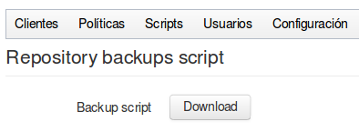

## Copia del repositorio

Con lo visto hasta hemos conseguido realizar copias de los datos de varios servidores, optimizando el espacio en disco y utilizando distintas políticas.

Pero ahora mismo tenemos todos los datos en un único disco, y si le pasara algo ya podemos ir diciendo adiós a nuestras copias.

Sería importante poder tener en algún otro sitio ***una copia*** del disco donde tenemos los datos, ***en una ubicación física distinta*** (para que no se viera involucrada en una situación de catástrofe), y que en la medida de lo posible que esta copia se sincronizara con la principal de forma automática.

En el menú podemos ver la opción ***Configuración → Script de copia del repositorio***, y dentro tenemos la opción ***Backup script descargar***.



Si hacemos clic en ese botón, descargaremos el siguiente script:

```bash
#!/bin/bash

MYSQL_DB=ElkarBackup
MYSQL_HOST=localhost
MYSQL_PASSWORD=root
MYSQL_USER=root
REPOSITORY=/var/spool/ElkarBackup/backups
SERVER=ElkarBackup
SERVER_USER=ElkarBackup
UPLOADS=/var/spool/ElkarBackup/uploads

ssh "$SERVER_USER@$SERVER" "cd '$REPOSITORY'; find . -maxdepth 2 -mindepth 2" | sed s/^..// | while read jobId
do
    echo Backing up job $jobId
    mkdir -p $jobId 2>/dev/null
    rsync -aH --delete "$SERVER_USER@$SERVER:$REPOSITORY/$jobId/" $jobId
done
echo Backing up mysql DB
ssh "$SERVER_USER@$SERVER" "mysqldump -u$MYSQL_USER -p$MYSQL_PASSWORD -h$MYSQL_HOST $MYSQL_DB" > ElkarBackup.sql
echo Backing up uploads
rsync -aH --delete "$SERVER_USER@$SERVER":"$UPLOADS/" uploads
```


Si ejecutamos este script en otra máquina (en adelante ***Secundario***):

1. Se conectara al servidor donde tenemos instalado ElkarBackup y lanzará la sincronización de las copias de seguridad existentes.
2. A continuación realizará una copia de seguridad del servidor MySQL en el fichero  ElkarBackup.sql
3. Por último también copiará los scripts que se hayan cargado en la carpeta  `/var/spool/ElkarBackup/uploads`.

Por lo tanto sería suficiente programar y lanzar la ejecución de este script en el servidor ***Secundario*** para tener la copia sincronizada de nuestro repositorio en su propio disco.

Esta claro que para prever la situación de catástrofe, no tendría mucho sentido que ambos servidores estuvieran ubicados en el mismo sitio .....
