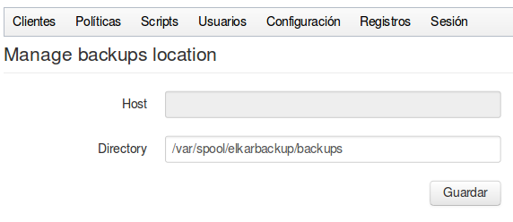

Estamos copiando los datos en disco, y tenemos que decirle al sistema cual va a ser la carpeta principal bajo la cual guardará los datos. El valor por defecto es la carpeta  `/var/spool/elkarbackup/backups`.

Si modificamos este parámetro una vez que hemos comenzado a realizar copias, el sistema no eliminará los datos antiguos, pero si intentamos acceder a ellos a través del botón Restore el sistema no los encontrará. Si por alguna razón necesitamos modificar este parámetro una vez que tenemos copias realizadas, deberíamos conectarnos a la consola del servidor y mover los datos de la ubicación antigua a la nueva.

Además, deberíamos asignar los permisos correspondientes en la nueva carpeta para el  usuario y grupo elkarbackup

```bash
root@backups:~# chown -Rf elkarbackup.elkarbackup nuevopath
```


El disco que el servidor está utilizando para almacenar los datos puede estar conectado físicamente, o bien estar montado a través de la red, por ejemplo a través de los protocolos [ISCSI](http://es.wikipedia.org/wiki/ISCSI) o [NFS](http://es.wikipedia.org/wiki/Network_File_System). Esta es una opción interesante cuando queremos montar ElkarBackup como servidor virtual.

La aplicación nos da la opción de definir cual va a ser el repositorio de las copias, y tenemos dos opciones:

- Disco local (dejando vacío el parámetro Host): Definimos un ***directorio*** local al servidor Debian en el que hemos instalado la aplicación ElkarBackup. Puede ser un disco físico o un disco montado previamente utilizando otras técnicas (por ejemplo a través de iscsi).
- Podemos configurar una carpeta de un servidor NFS (poniendo en el parámetro Host el Nombre/IPa del servidor). Para poder utilizar esta opción en el servidor Debian en el que hemos instalado ElkarBackup deberemos haber instalado el paquete ***autofs*** (nosotros lo hemos instalado al principio)



Es importante no olvidarse que si cambiamos la ubicación del repositorio el usuario ***elkarbackup*** de nuestro servidor Debian debe tener permisos de escritura en la nueva ubicación.
