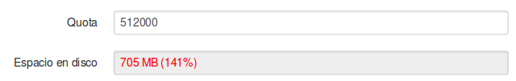

# Gestionar parámetros

## Claves SSH

Ya hemos hablado algo acerca de la clave pública. Desde aquí podemos descarga la clave pública del servidor ElkarBackup que previamente se ha generado desde este mismo sitio.

## Servidor MySQL

A continuación tenemos los parámetros para gestionar la configuración del servidor MySQL. Los ficheros de backup que se copian con Rsnapshot se guardan en disco, pero el resto de los datos  (datos de clientes y tareas, políticas, etc) se guardan en la base de datos.

El servidor MySQL puede estar ubicado en el servidor ElkarBackup o en cualquier otro servidor de nuestra red, aquí será donde se configurará la ubicación y los parámetros de conexión.

## Mensajes a través de correo electrónico

Si nos interesa recibir alertas por correo, debemos decidir que nivel de alertas queremos que envíe y a quién a de enviárselas.

En la configuración predeterminada se enviarán las alertas al ***propietario*** (esto lo veremos más adelante), y los mensajes que enviará serán del tipo ***Errores y superior***. Si nos interesa que además de al propietario las alertas se envíen también a otra dirección de correo, tendríamos que seleccionar la opción ***Email*** y añadir la nueva dirección en la caja de texto que se muestra.

Pero el servidor también necesita ser configurado para el envío de correos, es decir, necesita saber cómo tiene que enviar los mensajes, y para ello tenemos los parámetros ***Mailer***.

En la programación de esta sección se han utilizado los recursos del framework Symfony, por lo que podemos encontrar más información al respecto en [la documentación del proyecto Symfony](http://symfony.com/doc/current/cookbook/email/email.html).

## Avisos de cutoas

Hasta el momento no hemos hablado de las cuotas, pero podremos definir cuál va a ser la cuota de utilización de disco para cada cliente. Esto puede llegar a ser práctico cuando un cliente consume mucho espacio y no queremos perjudicar al resto de clientes que pueden quedarse sin espacio en disco.

Si definimos un máximo en el parámetro ***CUOTA*** de un cliente y es sobrepasado, lo veremos resaltado tanto desde la vista de cliente como desde la vista principal de clientes y tareas.

Hay que tener en cuenta que ***no se realizan copias de las tareas de un cliente que ha sobrepasado su CUOTA***.

Antes de que este límite sea sobrepasado el sistema nos enviará alertas. Mediante este parámetro definiremos el umbral a partir del cual se enviarán estas alertas, por defecto cuando el uso llegue al 80% de la cuota.

## Otros parámetros

- Cuánto tiempo mantendrá la información de LOG antes de eliminarla
- Número máximo de líneas por página que mostrará
- Prefijo que utilizará el sistema para generar ciertas URLs si en vez de utilizar un nombre resuelto por DNS para acceder al interfaz (por ejemplo http://elkarbackup) se utiliza una dirección IP fija (por ejemplo  http://IP/elkarbackup/app.php/login),  (en el ejemplo ***/elkarbackup***)
