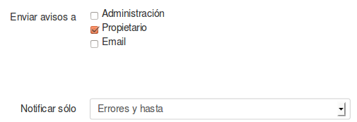
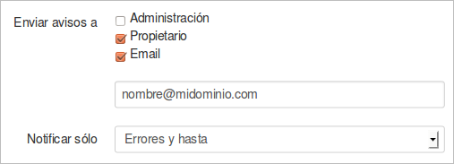
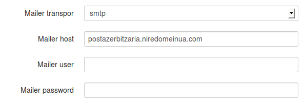

Si nos interesa recibir alertas por correo, debemos decidir que nivel de alertas queremos que envíe y a quién a de enviárselas.

En la configuración predeterminada se enviarán las alertas al ***propietario*** (esto lo veremos más adelante), y los mensajes que enviará serán del tipo ***Errores y superior***. Si nos interesa que además de al propietario las alertas se envíen también a otra dirección de correo, tendríamos que seleccionar la opción ***Email*** y añadir la nueva dirección en la caja de texto que se muestra.

Pero el servidor también necesita ser configurado para el envío de correos, es decir, necesita saber cómo tiene que enviar los mensajes, y para ello tenemos los parámetros ***Mailer***.

En la programación de esta sección se han utilizado los recursos del framework Symfony, por lo que podemos encontrar más información al respecto en [la documentación del proyecto Symfony](http://symfony.com/doc/current/cookbook/email/email.html).
