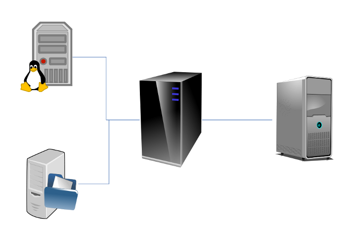

# ¿Qué es ElkarBackup?

No es nuestra intención empezar a explicar lo que es un sistema de copias de seguridad, ni subrayar la importancia de garantizar la seguridad de los datos, o cuan importante es tener bien automatizado el proceso de la copia de seguridad. Lo que al menos tendríamos que tener claro es:

* Que ese amigo nuestro llamado Murphy suele venir de visita cuando menos se le espera, y que conviene estar preparado.
* Que deberíamos tener siempre a mano copias realizadas en momentos distintos: copias diarias, semanales, mensuales, etc.
* Que deberíamos prever la situación de catástrofe (si, esa en la que se pierde todo) externalizando los datos de manera sistemática.

El sistema de copias de seguridad corporativo [ElkarBackup](http://elkarbackup.org) va a ser una solución más al alcance del administrador de sistemas, y estas son algunas de sus características:

* Se gestiona a través de un interfaz Web
* Realiza las copias a disco, no a cintas, por lo que será más rápido y no nos creará
dependencias con dispositivos especiales (hardware de gestión de cintas).
* Utiliza enlaces duros (en adelante [HardLinks](http://es.wikipedia.org/wiki/Enlace_duro)), por lo que el espacio que utiliza en
disco estará muy bien optimizado.
* El interfaz está localizado en euskara, castellano e inglés.
* Hemos tratado que el interfaz sea auto-documentado para en la medida de lo posible evitar la necesidad de tener que acudir al manual.

Es una herramienta de software libre con licencia [GPL V3](http://en.wikipedia.org/wiki/GNU_General_Public_License#Version_3), y se basa en otras cuantas herramientas de software libre, sobre todo en [RSnapshot](http://www.rsnapshot.org) y [RSync](http://es.wikipedia.org/wiki/Rsync). Aunque corre sobre sistemas GNU/Linux (hoy en día soportado sobre Debian), puede realizar copias de cualquier sistema operativo que soporte comunicación ssh/rsync.

Este proyecto se ha desarrollado como fruto de la colaboración entre el [IMH](http://www.imh.es) y [Tknika](http://www.tknika.net) durante el curso 2012-2013, con el objetivo de dotar a los centros formativos y en general a cualquier organización de una herramienta para realizar y gestionar sus copias de seguridad de forma centralizada, superando las carencias que habíamos detectado enotras herramientas similares. El desarrollo ha sido realizado por la empresa [Binovo](http://www.binovo.es), y el grupo [Elkarnet](http://www.tknika.net/liferay/web/elkarnet) ha colaborado en labores de testeo.

Durante el proceso que se describe en este manual veremos como se instala el servidor ElkarBackup, como lograr que este realice copias de ficheros de un equipo GNU/Linux y de un equipo Windows, y por último como realizar una copia de todo el repositorio en otro servidor.

