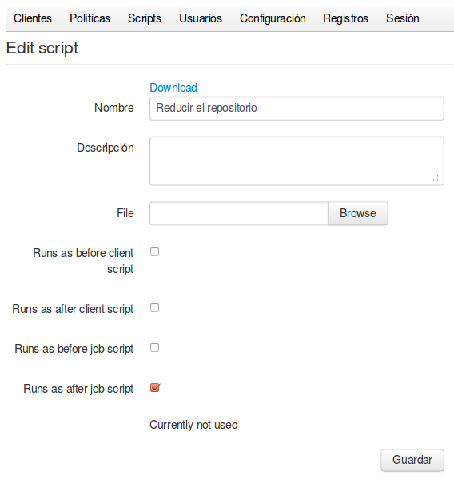

## Un nuevo script

Estos son los datos que nos pide al crear un nuevo script:

- Nombre y Descripción
- Fichero: Para cargar el script que previamente hemos programado en nuestro ordenador
- Opciones de ejecución: Dependiendo de la lógica de cada script, algunos estarán pensados para ser ejecutados ***a nivel de cliente***, mientras que otros pueden estar pensados para ejecutarse ***a nivel de tarea***. De ellos, algunos para se ejecutados como ***Pre-script*** (a realizar antes de que se ejecute la acción) y otros para ser ejecutados como ***Post-script*** (a realizar después de que se ejecute la acción). Nosotros decidiremos como pueden ser ejecutados, y en función de esa decisión tendremos la opción de escogerlos en los clientes y/o tareas.
- Variables de entorno: Dado que los scritps pueden utilizados en más de un sitio, al escribirlos desconocemos para qué cliente/carpeta se van a ejecutar, y en la mayoría de los casos esta información será necesaria. En nuestros scritps podremos utilizar las siguientes variables de entorno:
 - ELKARBACKUP_LEVEL: Su valor puede ser JOB o CLIENT
 - ELKARBACKUP_EVENT: Su valor puede ser PRE o POST
 - ELKARBACKUP_URL: Su valor será la URL completa de la tarea o cliente
 - ELKARBACKUP_ID: Código ID de la tarea o cliente (número)
 - ELKARBACKUP_PATH: Path completo de la carpeta raíz
 - ELKARBACKUP_STATUS: Estado de salida de Post-scripts,  en principio siempre 0.

Si vamos a visualizar o editar la información de un script previamente creado, podremos ver dónde está siendo utilizado, y también tendremos la opción de descargarlo a nuestro equipo.
Los scripts se guardan en la carpeta `/var/spool/ElkarBackup/uploads` del servidor.

Hemos puesto un ejemplo de Script en el apartado "***Script para comprimir el repositorio***".
