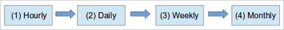

## Rotación

Esto no es algo complicado, pero hay que entenderlo bien. Al definir la frecuencia, también estamos estableciendo distintos niveles de copia, especificando de alguna forma que el Weekly ***precede*** al Monthly, que el Daily ***precede*** al Weekly, y que el Hourly ***precede*** al Daily. No hay ningún nivel que ***preceda*** al Hourly.

Podemos tener distintos políticas de copia, pero para el ejemplo imaginémonos que nuestra programación se compone de la siguiente manera:
- Las Hourly a las 11:00, 14:00 6 16:00, con una retención de 3
- Las Daily de lunes a viernes a las 21:00, con una retención de 10
- Las Weekly los sábados a las 21:00etan, con una retención de  5
- Las Monthly el 1 de cada mes a las 21:00, con una retención de  24

En este caso las copias se realizarían de la siguiente forma:

- Cuando llega la hora de ejecutar las Hourly primero borra la última (Hourly.2), y a continuación va cambiando el nombre del resto de carpetas. Hourly.1 → Hourly.2 y Hourly.0 → Hourly.1 . Después realiza la nueva copia en la carpeta Hourly.0 .
- Cuando llega la hora de ejecutar las Daily primero borra la última (Daily.9), y a continuación va cambiando el nombre del resto de carpetas. Daily.8 → Daily.9, Daily.7 → Daily.8, ..., Daily.0 → Daily.1 . La diferencia viene ahora, en este caso ***no se realizará una nueva copia*** para crear el Daily.0, se generará mediante una rotación de la última copia del nivel anterior:  Hourly.2 → Daily.0
- Cuando llega la hora de ejecutar las Weekly primero borra la última (Weekly.4), y a continuación va cambiando el nombre del resto de carpetas. Weekly.3 → Weekly.4, Weekly.2 → Weekly.3, ..., Weekly.0 → Weekly.1 . En este caso ***tampoco se realizará una nueva copia*** para crear el Weekly.0, se generará mediante una rotación de la última copia del nivel anterior:   Daily.9 → Weekly.0
- Cuando llega la hora de ejecutar las Monthly primero borra la última (Monthly.23), y a continuación va cambiando el nombre del resto de carpetas. Monthly.22 → Monthly.23, Monthly.21 → Monthly.22, ..., Monthly.0 → Monthly.1 . En este caso ***tampoco se realizará una nueva copia*** para crear el Monthly.0, se generará mediante una rotación de la última copia del nivel anterior: Weekly.4 → Monthly.0

Esto es lo que hay que entender: ***La rotación solamente moverá la última copia del nivel anterior***, nunca moverá ninguna otra carpeta. Es decir:

- Si la retención del Hourly es 3, la rotación del Daily solo moverá el Hourly.2, nunca el resto.
- Si la retención del Hourly es 2, la rotación del Daily solo moverá el Hourly.2, nunca el Hourly.0

En esta lógica hay una condición que tenemos que tener clara; Nunca se tocan las carpetas que acaban en .0, y por esta razón ***la retención no podrá ser 1 cuando en la política existan niveles superiores***, el Daily nunca tocará el Hourly.0, y el Weekly tampoco tocará el Daily.0 .

Es importante entender esto, ya que es la lógica que se utilizará por debajo cuando definamos las políticas desde el interfaz web.
