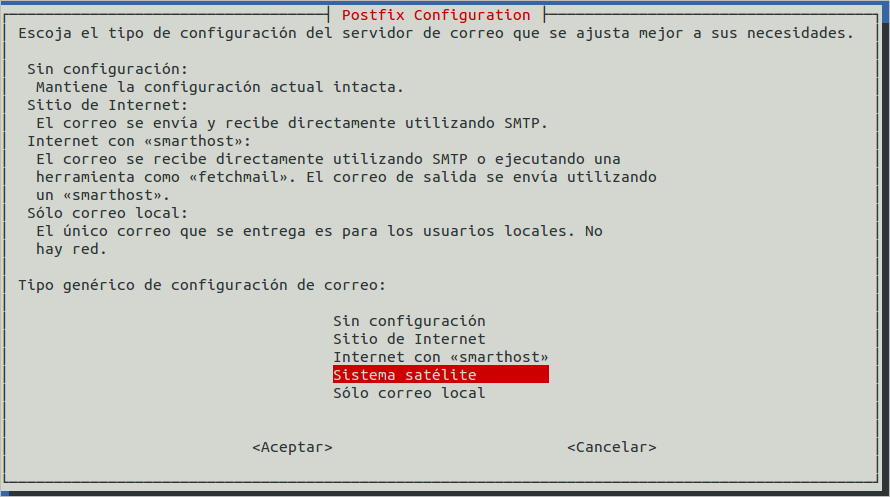
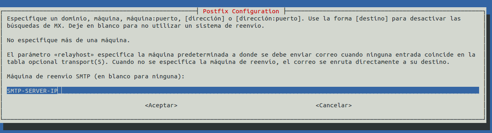

Aplikazioaren konfigurazioan posta elektronikoak SMTP zerbitzari baten bitartez bidaliko direla erabakitzen badugu, posta zerbitzari lokala konfiguratuta izan behar dugu mezuak bidaltzeko gai izan dadin.

Hau egiteko era ezberdinak daude, bat ElkarBackup zerbitzarian Postfix zebitzari bat instalatu eta satelite moduan konfiguratzea da. Postfix instalatzerakoan exim4 kenduko du (antzerako zerbait egin daiteke exim4 erabiliz, baina Postfix gehiago gustatzen zait ***:-)***  )

```bash
root@ElkarBackup:~# apt-get install mailutils postfix
```


***Sistema satelite***  aukeratzen dugu (Kanpora doazen mezu guztiak beste makina batera bidaltzen dira, host moduan ezagutzen dena. Root eta postmaster erabiltzaileen posta elektronikoak /etc/aliases fitxategian dagoen konfigurazioaren arabera bidaltzen da, eta posta lokalak bakarrik jasotzen dira)



Eta azkenik mezuak bidaltzeko erabiliko duen SMTP zerbitzaria zein den esaten diogu



