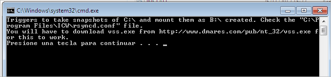

ElkarBackup zerbitzariko `/usr/share/elkarbackup/extra/windows` karpetan aurkituko ditugu Windows bezeroaren `c:\ElkarBackup` karpetan kopiatu behar ditugun fitxategiak. Garrantzitsua da ElkarBackup izena ondo idatzita egotea, E eta B hizkiak larriz edo maiuskulaz, eta beste hizkiak xehez edo minuskulaz idatzita. Scriptak hizki xeheak eta larriak desberdintzen ditu, eta karpetaren izena ondo ez badago, scriptak akatsak emango ditu. Ahaztu gabe, `c:\ElkarBackup\token`  karpeta sortu behar da, scriptak beharrezkoa du.

Windows bezeroan cwRsyncServer softwarea instalatuta izan behar dugu,  “***4.3 Windows Bezeroak gehitzen***“ atalean azaltzen den moduan.

Windows bezeroan `C:\ElkarBackup\INSTALL.bat` exekutatuko dugu, eta horrek cwRsyncServer-en konfigurazio fitxategian aldaketa batzuk egingo ditu ( `c:\Archivos de Programa\ICW\rsyncd.conf` ) , ondoren azaltzen diren lerroak gehituz.

```ini
# Phony modules to trigger snapshot creation and mounting
[MakeSnapshotCMountB]
path = /cygdrive/c/ElkarBackup/token
read only = true
transfer logging = yes
pre-xfer exec = /cygdrive/c/ElkarBackup/MakeSnapshotCMountB.cmd

[DeleteSnapshotCUmountB]
path = /cygdrive/c/ElkarBackup/token
read only = true
transfer logging = yes
pre-xfer exec = /cygdrive/c/ElkarBackup/DeleteSnapshotCUmountB.cmd

### WARNING: the following module WILL NOT WORK as expected
### the reason is that rsync tries to chdir to SomeDirectory before running the pre-xfer script. Since the B: unit does not exit it fails
### [ShadowWithSnapshot]
### path = /cygdrive/b/SomeDirectory
### read only = true
### transfer logging = yes
### pre-xfer  exec = /cygdrive/c/ElkarBackup/MakeSnapshotCMountB.cmd
### post-xfer exec = /cygdrive/c/ElkarBackup/DeleteSnapshotCUmountB.cmd
```


Scriptaren exekuzio bukaeran azaltzen den bezala, ***vss.exe*** programa deskargatu behar dugu helbide honetatik: http://www.dmares.com/pub/nt_32/vss.exe .



Deskargatu eta beste fitxategiekin batera ***C:\ElkarBackup*** karpetan utziko dugu.

