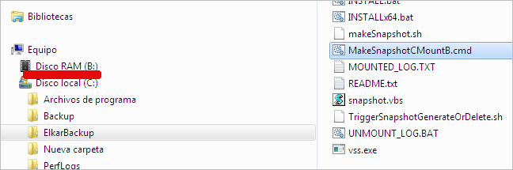

Aurrez esan dugun moduan, B unitatea ikusten duen bakarra rsync deamon edo zerbitzua da, beraz “sinetsi” behar dugu unitatea sortzen dela, erabili eta azkenik desegin egiten dela. Fede gutxikoak bagara, Windows bezeroan bere erabiltzaile lokalarekin snapshot-a sortzen ***jolastu*** dezakegu, horretarako rsync zerbitzuak erabiltzen dituen script berdinak erabiliz.

***C:\ElkarBackup\MakeSnapshotCMountB.cmd*** abiatzen badugu, ikus dezakegu nola bat-batean RAM unitate berri bat agertzen den B izenarekin. Orain bai ikusi dezakegula, geure erabiltzailearekin sortu baita.

B unitatean zer dagoen begiratzen badugu, C unitatean dagoen informazio berdina aurkituko dugu. Snapshot moduan funtzionatzen ari dela ziurtatzeko, hau da, snapshot-a sortu zenean C unitateak zuen informazioa dagoela eta hori bakarrik, C unitatean dagoen dokumenturen bat aldatu dezakegu. Ondoren B unitateko dokumentuaren edukia begiratzen badugu, hemen aldaketarik egon ez dela ikusiko dugu.

Normala den moduan, B unitatean irakurtzeko baimenak bakarrik dauzkagu, beraz ezin ditugu aldaketak egin, ezta ere dokumentu berririk sortu.

Eta egin beharreko lana bukatzen denean nola desegin dezakegu snapshot-a ? Ba  horretarako  ***C:\ElkarBackup\DeleteSnapshotCUmountB.cmd*** scripta exekutatuko dugu, eta B unitatea desagertuko da.

Script hauen atzetik dagoen ***magia*** zein den ikusi nahi badugu,  ***C:\ElkarBackup\snapshot.vbs*** scriptaren edukia begiratzea besterik ez dugu, bertan dago logika hau inplementatzen duen programazioa.
