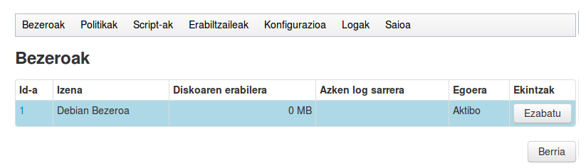
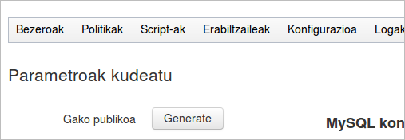
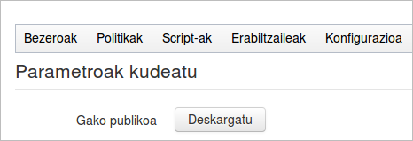
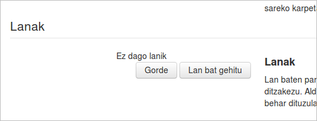
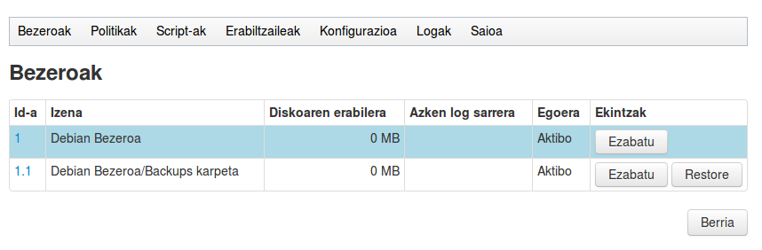
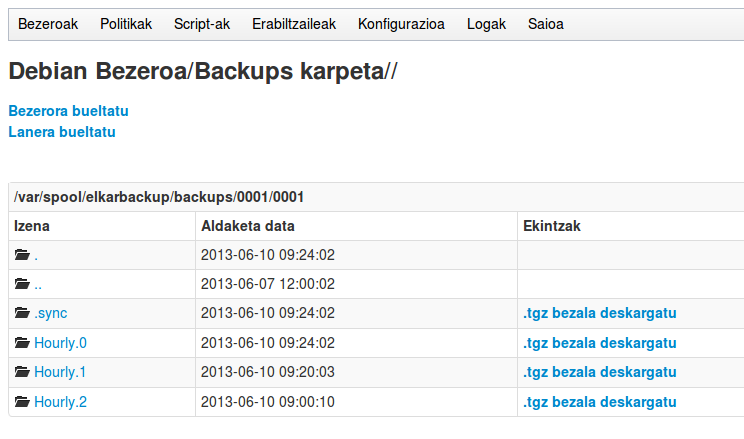
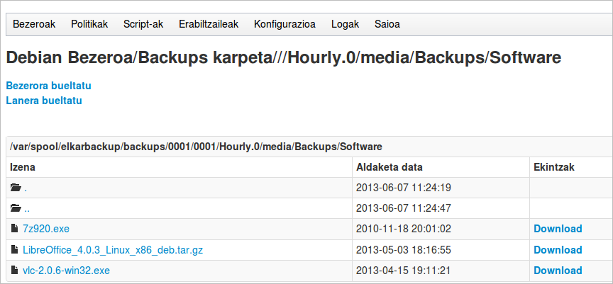
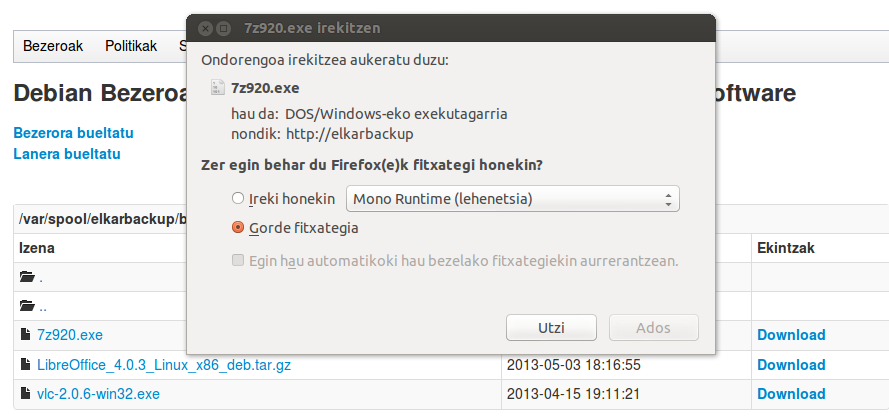

Bezero bat gehitzeko, ***Berria*** botoiaren gainean klikatu eta formulario berri bat azalduko zaigu. Aplikazioa autodokumentatua izatea saiatu gara, eta azalpen gehienak formularioan bertan daudenez, ez ditugu hemen azalpenak errepikatuko.

Gure adibidean erabiliko ditugun GNU/Linux zerbitzariaren datuak hauek izango dira:

- Izena: Debian Bezeroa
- URL: root@10.15.181.155
- KUOTA: -1 (ez dugu oraingoz kuotarik ezarriko)
- Azalpena: Gure sareko Linux zerbitzari bat
- Pre/Post script: ezer aukeratu gabe

Menuan ***Bezeroak → Erakutsi*** klikatzen badugu ikusiko dugu bezeroa zerrendan agertzen dela, nahiz eta oraindik lanik ez izan.



Baina, ...., kontutan izanik backupak egiteko komunikazioak automatizatuak izatea nahi dugula, ***ElkarBackup zerbitzua nola konektatuko da bezero honekin inon ere bere pasahitzik jarri ez badugu ?***

Komunikazioa ssh protokoloaren bidez izango direnez, gako publiko/pribatuak  erabiliko ditugu.

Menu nagusian: ***Konfigurazioa → Parametroak kudeatu → Generate*** botoiaren gainean behin behintzat klikatu behar dugu zerbitzariak bere gakoa sortu dezan



Aurrerantzean gako publikoa deskargatzeko aukera izango dugu.
Menu nagusian: ***Konfigurazioa → Parametroak kudeatu → Gako publikoa deskargatu***



***Deskargatu*** botoiaren gainean klikatu eta ***Publickey.pub*** fitxategian Elkarbackup zerbitzariaren gako publikoa deskargatuko dugu. Gako hau gure GNU/Linux bezeroetan instalatu beharko dugu, eta horrela ElkarBackup zerbitzariak datuak kopiatzerako orduan konexio automatizatuak abiatu ahal izango ditu.

Segurtasun kopian SSH bidez datuak kopiatzen direnean rolak honela banatzen dira:
- ElkarBackup zerbitzaria: konexioa zabalduko duen ***bezeroa*** izango da.
- GNU/Linux bezeroa: ssh konexioaren ***zerbitzaria*** izango da, beraz ***openssh-server*** paketea instalatuta izan beharko du (kasu gehienetan instalatuta izango dugu).

Gure adibidean honela instalatuko dugu ***Publickey.pub*** gakoa bezeroan. Erabiltzaile moduan web nabigatzailea erabiliz nire ekipora deskargatzen dut, eta ***ssh-copy-id*** komandoa erabiliz bezeroaren ***root*** erabiltzailean instalatzen dut. Normala den bezala hau egin ahal izateko bezeroaren root erabiltzaileak duen pasahitza ezagutu behar dut.

```
pedro@portatil59:~/Deskargak$ ssh-copy-id -i Publickey.pub root@10.15.181.155
root@10.15.181.155's password:
Now try logging into the machine, with "ssh 'root@10.15.181.155'", and check in:
  ~/.ssh/authorized_keys

to make sure we haven't added extra keys that you weren't expecting.
```


Demagun gure ekipo pertsonalean ez dugula GNU/Linux erabiltzen, eta ezin dugula komando hau erabili, kasu horretan gakoaren kopia ElkarBackup zerbitzaritik ere egin dezakegu. Honela egiten badugu, ez dago aurrez deskargatu beharrik, bere jatorriko helbidetik hartuko genuke:

```
root@elkarbackup:~# ssh-copy-id -i /var/lib/elkarbackup/.ssh/id_rsa.pub root@10.15.181.155
```


Egin dugunarekin bezeroaren root erabiltzaileko ssh konfigurazioan ElkarBackup zerbitzariak sortutako gakoa gehitu dugu, eta aurrerantzean bien arteko konexio automatizatuak abiatu ahal izango ditugu.

```
root@DebianBezeroa:~# ls -la /root/.ssh/authorized_keys
-rw------- 1 root root 428 jun  7 11:11 /root/.ssh/authorized_keys
root@DebianBezeroa:~# cat /root/.ssh/authorized_keys
ssh-rsa AAAAB3NzaC1yc2EAAAADAQABAAABAQC3HO3zn8XhBW1JqxA5qKEQZe+/fPcC47pu5l9c+s1Q+ppUD5CLaDQjUsF+0VBHtPP2Wx1HaDidFURwge5GcnRnoXV32B+Vj9rfW9wPdk6siuZ2McoS0xyqbToS2CTdbsxyjibn2CdM3RZjJa81haOllciu38V9F1t4mylJVMxBgQmNwkTBwYGt66+wpT/nQVxiDeyVK98SHb8oGKJZljpczlqgYwckRAEPSARvxFm9yyWOad3Qm7QYYGslBij4LXG1aUAARivoJdYtB4kbOnEdOO3n5BU/0Q8eIqxDw7eFdnx4UDINX+mtSuHfpRkoORoU9IZZWGz9vrLnaxqh91G3 Automatically generated key for tknikabackups.
```


Debian bezeroan ***rsync*** paketea ere instalatuta egon behar da. Ez balego honela instalatuko genuke

```
root@DebianBezeroa:~# apt-get install rsync
```


Orain lan berri bat sortuko dugu Debian bezeroan daukagun ***/media/Backups*** karpeta kopiatzeko. Horretarako aurrez sartu dugun bezeroaren konfigurazioa editatu eta beheko aldean dagoen ***Lan bat gehitu*** botoiaren gainean klikatuko dugu



Agertzen zaigun formularioa ere autodokumentatua dago eta nahiko ondo ulertzen da sartu beharreko informazioa zein den. Guk datu hauek sartuko ditugu, beste guztia dagoen moduan utzita:

- Izena: Backups karpeta
- Path: /media/Backups/
- Azalpena: Backups karpetan ditugun datuak
- Politika: Default policy

Eta ***Gorde*** botoiari emango diogu konfigurazioa gorde dezan. Orain berriro Bezeroen ikuspegi orokorrera joaten bagara lana hor dagoela ikusiko dugu.



Inoiz exekutatu ez denez ***Azken log sarrera*** zutabea utzik dago. Aurrerantzean zutabe horretan lan honen azken exekuzioko emaitza zein eta noiz izan den ikusi ahal izango dugu.

Baina noiz izango ditugu datuak ? Ba hori ***Politika*** planifikazioan jarritakoaren arabera izango da. Guk ***Default policy*** politika jarri diogu, eta hor zer dagoen ikustera joaten bagara, ikusiko dugu zein den definituta daukan programazioa eta erretentzio politika.

Politiken nondik norakoa ondo ulertzeko “***Oinarrien errepaso txiki bat: Rsnapshot***“ atalean azaldutako kontzeptuak argi izatea komeni da, azken finean hori delako hemen aplikatuko den logika. Bukaeran sakonduko dugu gai horretan.

Lehen kopia egiteko tartea utzi eta ***Restore*** botoian klikatuz zer gertatu den ikustera joaten bagara



Ikus dezakegu Hourly.0 karpeta hor dagoela azken kopiaren datuekin, eta hurrengoko exekuzioekin karpeta gehiago pilatzen joango dira. Karpeta barruan murgiltzen bagara, guk nahi dugun fitxategi zehatz batera heldu gaitezke.



Fitxategi horren kopia deskargatzeko, estekan klikatzea besterik ez da behar:


