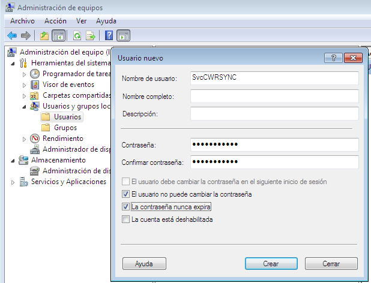
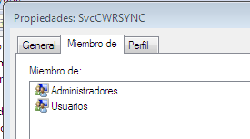
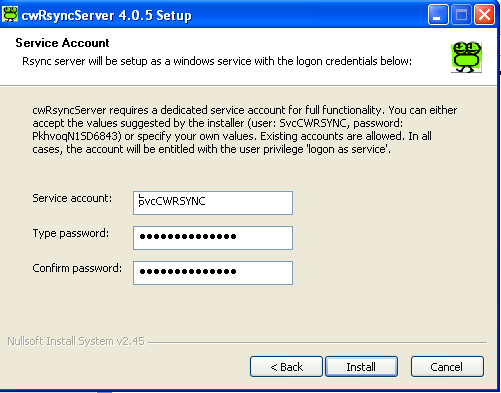
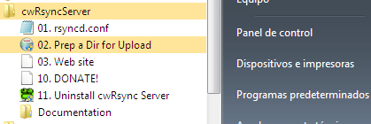
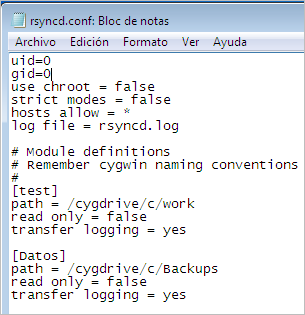
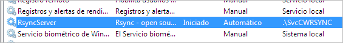
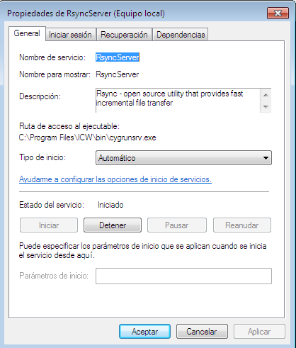
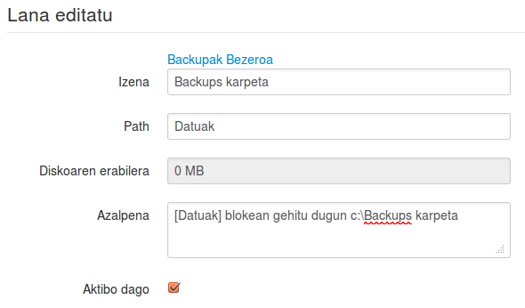
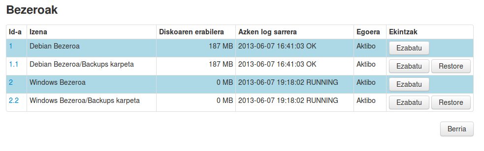

Windows eta Linux bezeroen arteko desberdintasuna ***URL*** parametroan dator, beste guztia berdina da.

Windows zerbitzariekin ez dugu ***ssh*** protokoloa erabiliko, ***rsync*** baizik. Hau egin ahal izateko Windows makinak rsync konexioak onartzeko prestatuta egon behar da, hau da, rsync zerbitzari bat martxan izan behar du.

- Izena: Windows Bezeroa
- URL: 10.15.181.156:
- KUOTA: -1
- Azalpena: Gure sareko Windows zerbitzari bat
- Pre/Post script: ezer aukeratu gabe

URL parametroan IPa jarri ondoren “:” jarri ditugu. Horrela adierazten diogu rsync protokoloa erabili behar duela.

Rsnyc zerbitzari desberdinak aurkitu ditzakegu Windows plataforman instalatzeko. Guk doako bertsioa duen [cwRsync](https://www.itefix.no/i2/content/cwrsync-free-edition) erabiliko dugu. Horretarako ***cwRsyncServer 4.0.5 Installer*** izeneko programa deskargatuko dugu.

Instalazioa egin aurretik, zerbitzarian erabiltzaile lokal bat gehituko dugu. Erabiliko dugun Windows7 makina birtualean nik ***SvcCWRSYNC*** deitu diot, eta ***elkarbackup*** pasahitza jarri diot.



Zerbitzua erabiltzaile honekin exekutatuko da, beraz baimenak izan beharko dituenez Administratzaileen taldean sartu dut (agian baimen gutxiagokin ere nahikoa izan daiteke).



Orain deskargatu dugun ***cwRsyncServer***  instalatuko dugu. Zerbitzurentzako erabiltzaile eta pasahitza eskatuko dizkigu, eta oraintxe bertan sortu ditugunak erabiltzeko esango diogu:



Instalazioa bukatzen denean programen artean beste bat aurkituko dugu, eta hor ikusten dugun ***rsyncd.conf*** fitxategia editatuko dugu sinkronizatu nahi ditugun karpetak zeintzuk diren zehazteko

Windows7an derrigorrezkoa da administratzaile moduan zabaltzea, bestela ez ditu aldaketak gordeko. Beraz, saguaren eskuineko botoiarekin klikatu eta administratzaile mdouan "exekutatu" beharko dugu.



Ondorengo irudian ikusten da nola utzi dudan C:\Backups karpeta konfiguratzeko.

Hasieran bi lerro jarriko ditugu:
```
uid=0
gid=0
```


Ondoren sinkronizatu nahi dugun karpeta bakoitzeko bloke bat gehitu behar dugu. Adibidean blokeari ***[Datuak]*** izena jartzen diogu:

```
[Datuak]
path = /cygdrive/c/Backups
read only = false
transfer logging = yes
```


Kopiatu nahi dugun karpeta **c:\**Backups izan beharrean **d:\**Backups izan balitz, path lerroa horrela geratuko litzateke

```
path = /cygdrive/d/Backups
```




Orain zerbitzua martxan dagoela ziurtatu, eta ez badago eskuz abiatu eta automatiko jarri. Horretarako zerbitzuetan begiratu






Orain ElkarBackup interfazera bueltatzen gara eta gehitu berri dugun Windows bezeroari  lan bat gehituko diogu, Backups karpeta kopiatzeko lana hain zuzen ere.

Gogoan izan Windows makinako konfigurazio fitxategian ***[Datuak]*** izeneko bloke bat sortu dugula, hori izango da orain ***Path*** eremuan erabiliko dugun izena, eta ***Default policy*** politika aplikatuko diogu



Gordeko dugu eta ondoren ***Exekutatu orain*** botoiaren gainean klikatuko dugu, ea dena ondo egiten duen probatzeko. Botoi honek kopia abatzeko aukera emango digu bere programazioaren zai egon gabe.

Kontutan izan lanen ikuspegi orokorra ematen digun pantailak askotan lanaren egoera ikusteko balio izango digula, adibidez zain dagoenean ***(QUEUED)*** edo exekuzioan dagoenean ***(RUNNING)***



Minutu bat itxaron eta kopia eginda aurkituko dugu. Nahi izan ezkero, Log-etara joan eta prozesuaren emaitza ikusterik ere badugu.


