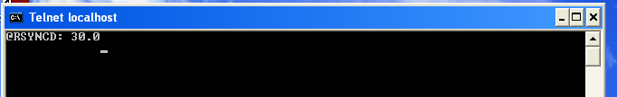

Kontutan izan behar da zerbitzari ezberdinen arteko komunikazioa erabiltzen dugunez, arazoak suertatu daitezkeela komunikazio hauetan. Arazo hauen jarraipena ***Logak*** atalaren bitartez egin ahal izango dugu.

Dokumentu hau idazterakoan arazo bat izan dut Windows bezeroaren komunikazioarekin, eta mezu hau ikusten nuen ***Logak*** atalean:

```
Command "/usr/bin/rsnapshot" -c "/tmp/rsnapshot.2_2.cfg" sync 2>&1 failed. Diagnostic information follows: rsync: failed to connect to 10.15.181.156: Connection timed out (110) rsync error: error in socket IO (code 10) at clientserver.c(122) [Receiver=3.0.7]
```


Sistemak esaten dit arazoak izan dituela bezeroarekin rsync bidez komunikatzeko. Honek gutxienez bi arrazoi izan ditzake:
- Windows bezeroan rsync zerbitzua ez dabil ondo
- Bezero horrekin Rsync protokoloarekin komunikazio arazoak dauzkagu

Lehenengo arazoa ote den jakiteko, rsync portura (TCP 873) telnet bat egiten saiatu naiz windows bezeroan bertan.


eta bere erantzuna hau bada, zerbitzua ondo dagoela esan nahi du



Ondoren konexio saiakera berdina egin dut baina oraingoan ElkarBackup zerbitzaritik Windows bezerora:

```
root@ElkarBackup:~# telnet 192.168.3.109 873
Trying 192.168.3.109...
telnet: Unable to connect to remote host: Connection timed out
```

ikusten dugunez ezin da komunikazioa ezarri, eta itxura osoa du arazoa suebaki baten egongo dela, ziurrenez Windows bezeroaren suebakian.

Gure adibidean, Windows7-k suebakia martxan dauka eta sare lokalean egon arren rsync trafikoa mozten ari da. Suebakiaren konfigurazioa aldatu eta behar diren arauak sortu behar dira Elkarbackup eta Windows bezeroaren artean ***rsync*** trafikoa (TCP 873) baimentzeko. Gure adibidean, eta azkarrago joateko asmoarekin suebakia geratu dugu.


