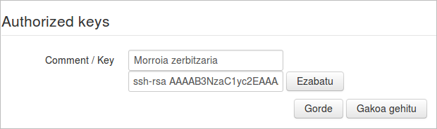

Exekuzio hau automatizatu nahi badugu, hau da, ***Morroia*** zerbitzariak programaturiko egunean eta orduan ***ElkarBackup*** zerbitzariko biltegia automatikoki sinkronizatzea nahi badugu, ezinbestekoa izango zaigu berriro ere gako publiko/pribatuaren estrategia erabiltzea.

Kasu honetan ***Morroia*** zerbitzariko gako publikoa ***ElkarBackup*** zerbitzarian inportatu beharko dugu, edo hobeto esanda, ***Authorized_keys*** fitxategian gehitu beharko dugu. Hau egiteko ***Gakoa gehitu*** botoiaren gainean klikatuko dugu.

Ikusten dugunez bi eremu dira bete behar ditugunak:

- Iruzkina: Gako identifikatzeko erabiliko dugun izena
- Gakoa: Morroia zerbitzariko ***gako publikoa***

Gauzak errazteko, ***Morroia*** zerbitzarian elkarbackup izeneko erabiltzaile bat sortuko dugu

```bash
root@morroia:~$ adduser elkarbackup
'elkarbackup' erabiltzailea gehitzen...
'elkarbackup' (1001) talde berria gehitzen...
'elkarbackup' (1001) erabiltzaile berria 'elkarbackup' taldearekin gehitzen...
'/home/elkarbackup' karpeta nagusia sortzen...
'/etc/skel'(e)tik fitxategiak kopiatzen...
UNIX-pasahitz berria sartu:
UNIX-pasahitz berria sartu berriro:
passwd: pasahitza ongi eguneratu da
elkarbackup(r)en erabiltzaile informazioa aldatzen
Idatzi balio berria, edo sakatu 'Sartu' tekla lehenetsirako
	Izen osoa []:
	Gela zenbakia []:
	Laneko telefonoa []:
	Etxeko telefonoa []:
	Bestelakoa []:
Informazioa zuzena da? [B/e] B
```

Ondoren erabiltzaile horrekin saioa ireki

```bash
root@morroia:~$ su - elkarbackup
```

eta RSA gakoa sortuko dugu

```bash
elkarbackup@morroia:~$ ssh-keygen -t rsa
Generating public/private rsa key pair.
Enter file in which to save the key (/home/elkarbackup/.ssh/id_rsa):
Created directory '/home/elkarbackup/.ssh'.
Enter passphrase (empty for no passphrase):
Enter same passphrase again:
Your identification has been saved in /home/elkarbackup/.ssh/id_rsa.
Your public key has been saved in /home/elkarbackup/.ssh/id_rsa.pub.
The key fingerprint is:
1a:65:fd:52:08:05:89:8a:3a:89:68:23:72:c3:37:0e elkarbackup@portatil59
The key's randomart image is:
+--[ RSA 2048]----+
|       .o+.      |
|      . .o .     |
|   . .  o o .    |
|  . .  o   o     |
|o+    . S . .    |
|OoE o  o   .     |
|+o.= ..          |
|    .            |
|                 |
+-----------------+
```


Orain gako publikoa zein den ikusi eta kopiatu egingo dugu

```bash
elkarbackup@morroia:~$ cat .ssh/id_rsa.pub
ssh-rsa AAAAB3NzaC1yc2EAAAADAQABAAABAQCuklE6TI16fU5pmTeU4APrSgG24eblwQdnHNtntUIIRSyAkAemPil2GDpufXgPKqT+FQV02z4JiaoTMMhQpsGqS/Shz/KE/MA7pm8k9v6qnFKVpY6HXZZyvgYhH+Yy6FxxDk+QGQqQMnabzmanyxcBBdQ3ZdluYbwT5kdlgAJR8eTlN/M08hrKKeQGbEVXP3GCPWYsiDV2p6VgRgkPzCSWUgMP63668ZAoNq8mlhW8RF+BEYDF9TPh7PJaEhc+Ea5LiiggD/E2lqQmFGYTqbjELKT4b97y6nDj+2UIG0pvqZ/dN0ZMdsCMX577e8ppkafMqgwGT3D7Af4gD9KninL3 ElkarBackup@morroia
```


eta ElkarBackup  web aplikazioaren interfazeak ematen digun aukera aprobetxatuz, gakoa hau gehituko dugu zerbitzariko `authorized_keys` fitxategian.



Gorde botoiari eman eta nahiko.

Ondoren Morroia zerbitzarian karpeta bat sortuko dugu erreplika bertan izateko, eta bertara kopiatuko dugu web interfazetik deskargatu dugun scripta.

```bash
ElkarBackup@morroia:~$ ls -la biltegiarenkopia/
guztira 12
drwxrwxr-x 2 elkarbackup elkarbackup 4096 eka 10 17:02 .
drwxr-xr-x 4 elkarbackup elkarbackup 4096 eka 10 16:53 ..
-rwxrwxr-x 1 elkarbackup elkarbackup  695 eka 10 15:24 copyrepository.sh
```

eta exekuzioa testatuko dugu

```bash
elkarbackup@portatil59:~$ cd biltegiarenkopia/
elkarbackup@portatil59:~/biltegiarenkopia ./copyrepository.sh
Backing up job 0002/0002
Backing up job 0001/0001
Backing up mysql DB
Backing up uploads
```

Ikusten dugunez erreplikazioa egiten du inongo erabiltzaile eta pasahitzik eskatu gabe.

```bash
elkarbackup@portatil59:~/biltegiarenkopia ls -la
guztira 128
drwxrwxr-x 5 elkarbackup elkarbackup   4096 eka 10 17:04 .
drwxr-xr-x 4 elkarbackup elkarbackup   4096 eka 10 16:53 ..
drwxrwxr-x 3 elkarbackup elkarbackup   4096 eka 10 17:04 0001
drwxrwxr-x 3 elkarbackup elkarbackup   4096 eka 10 17:04 0002
-rwxrwxr-x 1 elkarbackup elkarbackup    695 eka 10 15:24 copyrepository.sh
-rw-rw-r-- 1 elkarbackup elkarbackup 103785 eka 10 17:04 ElkarBackup.sql
drwxr-xr-x 2 elkarbackup elkarbackup   4096 eka  6 15:32 uploads
```


