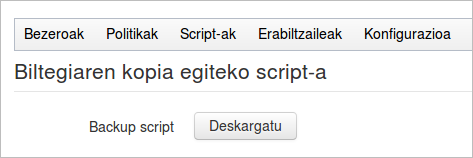

Orain arte egin dugunarekin hainbat zerbitzarietan dauzkagun datuen kopia egitea lortu dugu, diskoan ahalik eta leku gutxien okupatzen eta politika ezberdinak erabiliaz.

Baina datu hauek disko batean dauzkagu, eta disko horri zerbait gertatuko balitzaio, agur gure kopiak.

Garrantzitsua litzateke kopia guztiak gordetzen dituen disko horren ***beste kopia bat*** beste nonbaiten izatea, ***fisikoki beste leku batean*** (hondamendi egoera batean kaltetua ez izateko), eta posible den heinean bigarren kopia hori gure kopia nagusiarekin era automatikoan sinkronizatuta izatea.

Menuan ***Konfigurazioa → Biltegiaren kopia egiteko script-a*** aukeran ***Backup script deskargatu*** aukera ikus dezakegu.



Botoi horren gainean klikatzen badugu, ondorengo script hau deskargatuko dugu:

```bash
#!/bin/bash

MYSQL_DB=ElkarBackup
MYSQL_HOST=localhost
MYSQL_PASSWORD=root
MYSQL_USER=root
REPOSITORY=/var/spool/ElkarBackup/backups
SERVER=ElkarBackup
SERVER_USER=ElkarBackup
UPLOADS=/var/spool/ElkarBackup/uploads

ssh "$SERVER_USER@$SERVER" "cd '$REPOSITORY'; find . -maxdepth 2 -mindepth 2" | sed s/^..// | while read jobId
do
    echo Backing up job $jobId
    mkdir -p $jobId 2>/dev/null
    rsync -aH --delete "$SERVER_USER@$SERVER:$REPOSITORY/$jobId/" $jobId
done
echo Backing up mysql DB
ssh "$SERVER_USER@$SERVER" "mysqldump -u$MYSQL_USER -p$MYSQL_PASSWORD -h$MYSQL_HOST $MYSQL_DB" > ElkarBackup.sql
echo Backing up uploads
rsync -aH --delete "$SERVER_USER@$SERVER":"$UPLOADS/" uploads
```


Script hau beste makina batean (aurrerantzean ***Morroia*** deituko diogu) exekutatzen badugu:

1. ElkarBackup paketea instalatuta dagoen zerbitzarira konektatuko da eta hor dauzkagun kopia guztien sinkronizazioa abiatuko du.
2. Ondoren MySQL datu basearen backup bat egin eta ElkarBackup.sql fitxategian datu guztiak jasoko ditu
3. 3. Azkenik `/var/spool/ElkarBackup/uploads` karpetara igo diren script guztiak ere kopiatuko ditu.

Beraz nahikoa izango genuke script honen exekuzioa ***Morroia*** zerbitzarian guk nahi dugun egun eta orduan programatzea biltegiaren kopia osoa bere diskoan izateko.

Esan beharrik ez dago, baina hondamendi egoera baten aurrean ez luke zentzu handirik izango bi zerbitzariak leku fisiko berdinean izateak .....
