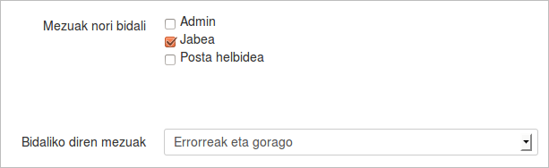
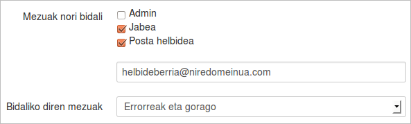
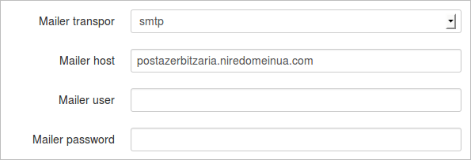
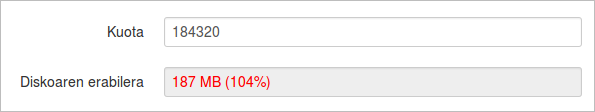
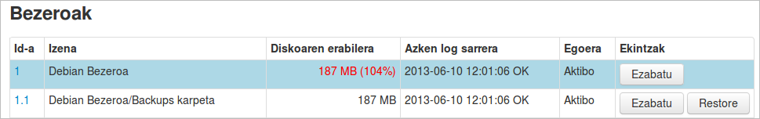
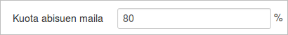

## Parametroak Kudeatu

### SSH Gakoak

Gako publikoari buruz lehen ere hitz egin dugu. Hemendik deskargatu dezakegu aurrez ere hemen bertan sortu dugun ElkarBackup zerbitzariaren gako publikoa.

### MySQL Zerbitzaria

Ondoren MySQL zerbitzariaren konfigurazioa kudeatzeko parametroak dauzkagu. Rsnapshot bitartez kopiatzen diren fitxategiak diskoan gordetzen dira, baina beste datu guztiak (bezero eta lanen datuak, politikak, eta abar) datu basean gordetzen dira.

MySQL zerbitzaria ElkarBackup zerbitzarian edo beste zerbitzari baten egon daiteke, beraz hemen konfiguratuko dugu datu base atzipenerako behar diren datuak.

### Posta elektroniko bidezko mezuak

Lan bat definitzerakoan lan honek alertak bidaltzea nahi ote dugun erabaki behar dugu, zein mailako alertak bidaliko dituen eta nori.

Konfigurazio lehenetsian mezuak ***jabeari*** bidaliko dizkio (honetan geroago sakonduko dugu), eta bidaliko dituen mezuan ***Erroreak eta gorago***koak izango dira. Jabeaz gain lan honi buruzko alertak beste norbaitek jasotzea nahiko bagenu, ***Posta helbidea*** laukitxoa aukeratu eta azalduko zaigun kutxan helbide elektroniko berria idatziko genuke.

Baina zerbitzariak mezuak bidali ahal izateko bere konfigurazioa ere behar du, hau da, zerbitzariak mezu elektronikoak nola bidali behar dituen jakin behar du, eta horretarako dauzkagu ***Mailer*** parametroak.

Atal hau programatzerakoan Symfony framework-ak dituen baliabideak erabili dira, eta informazioa gehiago aurkitu daiteke [Symfony proiektuko dokumentazioan](http://symfony.com/doc/current/cookbook/email/email.html).

## Kuota abisuak

Kuotaren gaia ere ez dugu orain arte aipatu, baina diskoaren erabileran bezero bakoitzak izango duen muga zehaztu dezakegu. Hau praktikoa izan daiteke bezero batek datu gehiegi dituenean eta ez dugunean beste bezeroak kaltetu nahi batek leku guztia agortzen duelako.

Bezero mailan ***Kuota*** parametroan muga bat jarri eta gainditzen denean bezeroaren fitxan datu hau nabarmenduko da eta bezero eta lanen ikuspegi nagusian ere ikusiko dugu

Kontutan izan bezero batek bere ***kuota gainditzen duenean ez direla bezero horren kopiak egingo***.

Muga gainditu aurretik sistemak alerta edo abisuak bidaliko dizkigu. Parametro honen bitartez guk aukeratuko dugu noiz bidali behar duen abisua, kasu honetan bezeroaren disko erabilera kuotaren %80ra heltzen denean.

### Beste parametroak

- Aplikazioaren Log-ak zenbat denboraz mantendu behar diren automatikoki ezabatzen joan aurretik
- Aplikazioak orrialde bakoitzean erakutsiko duen lerro kopurua
- Interfazea erabiltzeko DNS izen bat erabili beharrean (adibidez http://elkarbackup )IP finkoa erabiltzen dugunean (adibidez http://IP/elkarbackup/app.php/login) , sistemak hainbat lekutan URLak osatzeko erabiliko duen aurrizkia (gure adibidean ***/elkarbackup*** izango litzateke)
