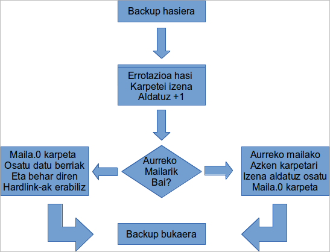

Hau da ulertu beharreko kontu garrantzitsuenetako bat. Alde batetik programazioa konfiguratzeko area ikus dezakegu, 5 fitxaz osatzen dena:

- Hourly edo Egunean zehar: Egunaren barruan, ordu ezberdinetan egingo dituen kopiak.
 1. Lehenengo Hourly karpeten errotazioa egingo du, azkena ezabatu eta besteei beti +1 eginez
 2. Hourly.0 karpeta sortu eta osatu: fitxategi berriak eta behar diren hardlink-ak

- Daily edo Egunero: Egunean behin ordu zehatz batean, eta aukeratutako asteko egunetan egingo duen kopia. Kontutan izan politika honen barruan aurreko mailan kopiak aktibatuta daudenean, hemen ez direla kopia berririk egingo, errotazioa baizik: Azken Hourly kapeta Daily.0 bihurtuko delarik.
 1. Lehenengo Daily karpeten errotazioa egingo du, azkena ezabatu eta besteei  beti +1 eginez
 2. Aurreko maila (Hourly) erabiltzen da ?
   - Bai: Daily.0 osatzeko azken Hourly karpetari izena aldatu
   - Ez: Daily.0 karpeta sortu eta osatu: fitxategi berriak eta behar diren hardlink-ak.

- Weekly edo astero: Astean behin astegun eta ordu zehatz batean egingo duen kopia. Kontutan izan politika honen barruan aurreko mailan kopiak aktibatuta daudenean, hemen ez direla kopia berririk egingo, errotazioa baizik: Azken Daily kapeta Weekly.0 bihurtuko delarik.
 1. Lehenengo Weekly karpeten errotazioa egingo du, azkena ezabatu eta besteei beti +1 eginez
 2. Aurreko maila (Daily) erabiltzen da ?
   - Bai: Weekly.0 osatzeko azken Daily karpetari izena aldatu
   - Ez: Weekly.0 karpeta sortu eta osatu: fitxategi berriak eta behar diren hardlink-ak.
- Monthly edo Hilero: Goian aipatutako logika berdina errepikatzen da
- Yearly edo urtero: Goian aipatutako logika berdina errepikatzen da



Maila bakoitzeko ***azken karpeta*** aipatu dugu behin baino gehiagotan. Honek zer ikusia du erretentzio politikarekin. Esaten dugunean maila baten erretentzioa N dela, horrek esan nahi du maila horretan sortuko diren karpetak 0tik (N-1)erarte izendatuko direla.

Adibidez, egunean zehar egin beharreko kopiak 4ko erretentzioa izango dutela esaten badugu, sistemak 4 karpeta gordeko ditu: Hourly.0,  Hourly.1,  Hourly.2 eta  Hourly.3 gordeko ditu.

Hourly errotazioa heltzen denean hau egingo du:

Azken Hourly-a ezabatu:

```bash
rm -Rf Hourly.4
```

beste guztiei izena aldatu errotazioa osatuz

```bash
mv Hourly.3 Hourly.4
mv Hourly.2 Hourly.3
mv Hourly.1 Hourly.2
mv Hourly.0 Hourly.1
```

eta azkenik Hourly.0 berri bat sortu eta bere edukia osatu, horretarako fitxategi berriak beratara kopiatu eta behar diren Hardlink-ak sortuz.

