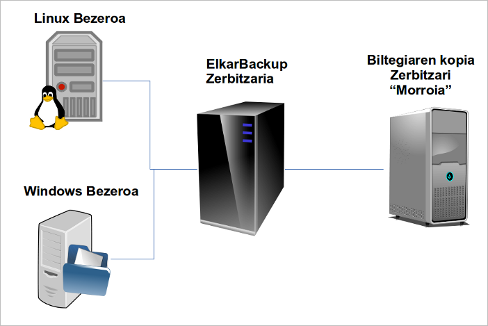

Ez da gure asmoa hemen segurtasun kopia sistema bat zer den azaltzea, ezta ere datuen segurtasuna bermatzea zein garrantzitsua den azpimarratzea, edo zergatik izan behar dugun kopia prozesu hau automatizatua. Hala ere, argi izan behar dugu:

- Murphy, gure aspaldiko lagun hori, gutxien espero dugunean agertu daitekeela bisita egitera, eta prestatuta egotea komeni dela
- Maiztasun ezberdinez egindako kopiak prest izan behar ditugula: egunekoak, astekoak, hilekoak, eta abar
- Hondamendi egoera (bai, dena galtzen den egoera hori) ere aurreikusi beharko genukeela kopiak erakundetik aterata.

[ElkarBackup](http://elkarbackup.org) erakundearen datuen segurtasun kopiak kudeatzeko sistema izanik,  administratzaileak bere eskura izango duen beste soluzio bat izango da, eta hauek dira bera ezaugarrietako batzuk:

- Web interfaze baten bidez kudeatzen da
- Kopiak diskora egingo ditu, ez zintetara, beraz azkarragoa izango da eta ez digu gailu fisiko ***bereziekiko (zintak kudeatzeko gailuak)*** dependentziarik sortuko.
- Esteka gogorrak (aurrerantzean [HardLink](http://es.wikipedia.org/wiki/Enlace_duro)) erabiliko ditu, beraz fitxategiak diskoan okupatzen duten espazioa oso ondo optimizatuta egongo da.
- Interfazea euskara, gaztelania eta ingelesera lokalizatua dago.s.
- Interfazea autodokumentua izatea saiatu gara, ahal den neurrian eskuliburura jo beharrik ez izateko.

Software librean oinarritzen den tresna da, [GPL V3](http://en.wikipedia.org/wiki/GNU_General_Public_License#Version_3) lizentziapean banatzen da, eta beste hainbat tresna libreetan oinarritzen da, batez ere [RSnapshot](http://www.rsnapshot.org) eta [RSync](http://es.wikipedia.org/wiki/Rsync). GNU/Linux sistemetan instalatzen den arren (gaur egun Debian distribuziorako prestatua izan da), ssh/rsync exekutatu dezakeen edozein sistema eragiletako datuen kopiak egin ditzake.

Proiektu hau [IMH](http://www.imh.es) eta [Tknika](http://www.tknika.net)ren elkarlanez garatu da 2012-2013 ikasturtean, ikastetxeei eta oro har beste edozein erakunderi kopiak modu zentralizatuan egiten laguntzeko, aurkitu izan dugun tresnak zituzten gabeziak gainditzeko asmoarekin. Garapena [Binovo](http://www.binovo.es) enpresak eginikoa da, eta testatzen [Elkarnet](http://www.tknika.net/liferay/web/elkarnet) taldeko partaideak aritu dira.

Eskuliburu honetan azalduko dugun prozesuaren bukaeran ikusiko dugu nola instalatzen den ElkarBackup zerbitzaria, nola lortu GNU/Linux zerbitzari baten eta Windows Zerbitzari baten datuen kopiak egitea, eta azkenik datuen kopiaren emaitza den biltegia nola sinkronizatu daitekeen beste urruneko zerbitzari batean.

