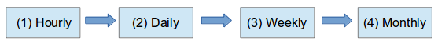

## Errotazioa

Hau ez da zaila, baina ondo ulertu behar da. Maiztasuna definitzerakoan hauen arteko mailakatzea ere definitzen ari gara, nolabait Monthly-aren ***azpitik*** Weekly-a dagoela esanez, Weekly-aren ***azpitik*** Daily-a, eta azkenik Daily-aren ***azpitik*** Hourly-a. Hourly-aren azpitik ez dago beste mailarik.

Kopia politika ezberdinak izan ditzakegu, baina adibidea azaltzeko demagun gure programazioa honela osatzen dela:
- Hourly-ak 11:00, 14:00 eta 16:00etan, 3ko erretentzioarekin
- Daily-ak astelehenetik ostiralera 21:00etan, 10eko erretentzioarekin
- Weekly-ak larunbatetan 21:00etan, 5eko erretentzioarekin
- Monthly-ak hilaren batean 21:00etan, 24ko erretentzioarekin

Kasu honetan kopiak honela egingo lirateke:

- Hourly-a exekutatzeko ordua heltzen denean, azkena (Hourly.2) ezabatu egiten da, eta besteen izenak aldatzen dira. Hourly.1 → Hourly.2 eta Hourly.0 → Hourly.1 . Une horretan kopia berria egiten du Hourly.0 karpetan.

- Daily-a exekutatzeko ordua heltzen denean, azkena (Daily.9) ezabatu egiten da, eta besteen izenak aldatzen dira. Daily.8 → Daily.9, Daily.7 → Daily.8, ..., Daily.0 → Daily.1 . Desberdintasuna hemen dator, kasu honetan ***ez da kopia berri bat egingo*** Daily.0 sortzeko, aurreko mailako azken kopia erabiliz errotazio baten bitartez osatuko da: Hourly.2 → Daily.0

- Weekly-a exekutatzeko ordua heltzen denean, azkena (Weekly.4) ezabatu egiten da, eta besteen izenak aldatzen dira. Weekly.3 → Weekly.4, Weekly.2 → Weekly.3, ..., Weekly.0 → Weekly.1 . Kasu honetan ere ***ez da kopia berri bat egingo*** Weekly.0 sortzeko, aurreko mailako azken kopia erabiliz errotazio baten bitartez osatuko da: Daily.9 → Weekly.0

- Monthly-a exekutatzeko ordua heltzen denean, azkena (Monthly.23) ezabatu egiten da, eta besteen izenak aldatzen dira. Monthly.22 → Monthly.23, Monthly.21 → Monthly.22, ..., Monthly.0 → Monthly.1 . Kasu honetan ere ***ez da kopia berri bat egingo*** Monthly.0 sortzeko, aurreko mailako azken kopia erabiliz errotazio baten bitartez osatuko da: Weekly.4 → Monthly.0

Ulertu behar dena hau da: Errotazio batek ***beheragoko mailako azken kopia bakarrik*** mugi dezake, inoiz ere ez besteak. Hau da:

- Hourly erretentzioa 3 bada, Dailyk Hourly.2 ukituko du, inoiz ez besteak.
- Hourly erretentzioa 2 bada, Dailyk Hourly.1 ukituko du, inoiz  ez hourly.0

Logika guzti honetan argi izan behar dugun muga bat dago. Inoiz ez dira ukitzen .0 bukatzen diren karpetak, eta horregatik ***erretentzioa ezin da 1 izan goragoko mailarik dagoenean***, Daily-k ez du inoiz hourly.0  ukituko, ezta Weekly-k daily.0 ere.

Hau guztia ulertzea garrantzitsua da, gero web interfazean politikak programatzerakoan azpitik aplikatuko den logika hau delako.
